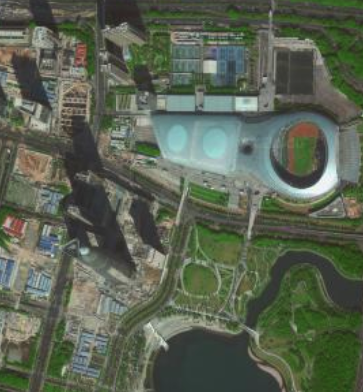
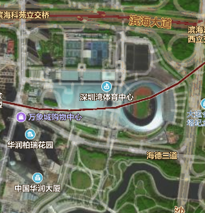

# 地图相关知识整理(地理信息)

### 前言
地理信息系统（Geographic Information System或 Geo－Information system，GIS）有时又称为“地学信息系统”。它是一种特定的十分重要的空间信息系统。它是在计算机硬、软件系统支持下，对整个或部分地球表层（包括大气层）空间中的有关地理分布数据进行采集、储存、管理、运算、分析、显示和描述的技术系统。
[参考百度百科](https://baike.baidu.com/item/%E5%9C%B0%E7%90%86%E4%BF%A1%E6%81%AF%E7%B3%BB%E7%BB%9F/171830?fromtitle=GIS&fromid=31541&fr=aladdin)


## 个人对GIS的一些理解
```
仅为个人的一些粗浅理解，对GIS感兴趣的老哥们可以深入研究，也期待对GIS相关内容指正补充。
```
- 必须了解GIS这个概念，它有助于前端开发更好的使用web端地图，它是web地图的组成部分。

- 地图上展示的信息都统称为GIS，例如道路、房屋，等地理信息。 并以layer形式绘制在地图上。
- GIS通过信息采集 => 处理 => 可视化,最终在地图中展示。
- 可以对GIS进行分析管理搜索
### 举例（深圳南山某区域的卫星图）：
不附带地理信息的瓦片



附带地理信息的瓦片



很清楚的可以看出GIS的重要性

## 地理信息系统
- 地理信息系统是一门学科，是描述、存储、分析和输出空间信息的理论和方法的一门新兴的交叉学科

- 地理信息系统是一个技术系统，是以地理空间数据库（Geospatial Database）为基础，采用地理模型分析方法，适时提供多种空间的和动态的地理信息，为地理研究和地理决策服务的计算机技术系统。

- 一个完整的GIS主要由四个部分构成，即计算机硬件系统、计算机软件系统、地理数据（或空间数据）和系统管理操作人员。其核心部分是计算机系统（软件和硬件），空间数据反映GIS的地理内容，而管理人员和用户则决定系统的工作方式和信息表示方式。
